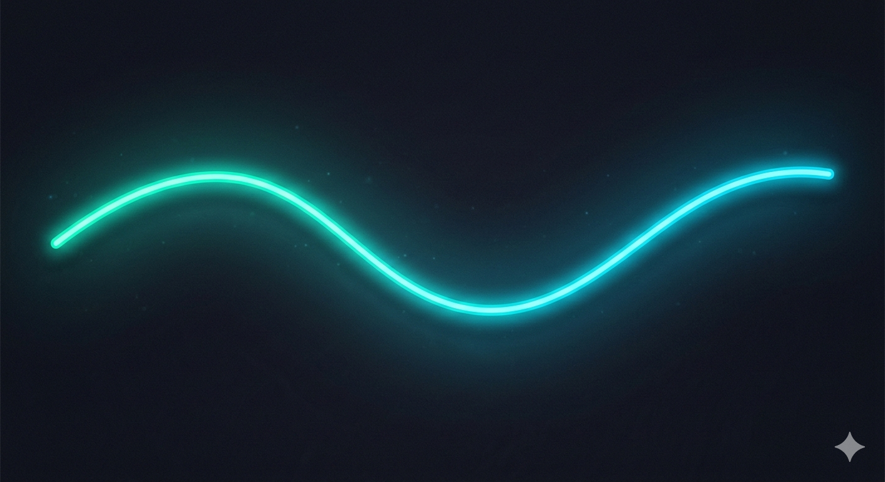

<!--
  Ultimate Pro GitHub Profile README for Tamirat Dereje (tamed29)
  - Modern dark/neon theme, glassmorphism, and interactive design
  - 100% GitHub-renderable (Markdown+HTML+svg+shields.io only)
  - No broken images (uses GitHub or shields-hosted SVGs)
  - Advanced typography, spacing, color separation
  - Section comments for easy editing!
  - Fast, lightweight, and optimized for future customization!
-->

<!-- ======================== HERO / INTRO ======================== -->

  <!-- Animated Typing Banner: Fira Code, neon blue -->
  

  <!-- Profile photo inside neon ring (GH hosted, for reliability) -->
  

<!-- Wave separator -->

  

<!-- ======================== ABOUT ME / HERO CARD ======================== -->

  
<b>
  
    Building robust backends & automating workflows. 
    Clean code, efficient ops, future-ready products. 
  
</b>
<em>
  <b>Backend · Automation · Cloud · Open Source</b>
   
  <a href="https://tamed29.dev">🌐 tamed29.dev</a> &nbsp;|&nbsp; 
  tamiratdereje@gmail.com
</em>

<!-- ======================== SECTION SEPARATOR ======================== -->

  

<!-- ======================== TECH STACK ======================== -->
<h2 align="center">🛠️ Tech Stack & Tools</h2>

  
  
  
  
  
  
  
  
  
  
  
  

<!-- ======================== WAVY SEPARATOR ======================== -->

  

<!-- ======================== SKILLS (Progress Bars) ======================== -->
<h2 align="center">📊 Skills Overview</h2>

  

<!-- Text fallback in case SVG fails -->

  Python &nbsp;&nbsp;███████████████▉ 90% 
  TypeScript &nbsp;&nbsp;█████████████▏ 80% 
  Backend &nbsp;&nbsp;███████████████▉ 95% 
  Automation &nbsp;&nbsp;█████████████▍ 85% 
  Web (React) &nbsp;&nbsp;███████████▋ 70% 
  DevOps &nbsp;&nbsp;██████████▌ 60%

<!-- ======================== GITHUB DASHBOARD / ACTIVITY ======================== -->

  <!-- Profile details -->
  

  
  

<!-- Contribution Activity Graph -->

  

  

<!-- Stats auto-update, always dark/neon ready -->

<!-- Wave separator -->

  

<!-- ======================== FEATURED PROJECTS ======================== -->
<h2 align="center">🚀 Featured Projects</h2>

  
  

<!-- ======================== ACHIEVEMENTS ======================== -->
<h2 align="center">🏆 Achievements</h2>

  
  
  
  

  

<!-- ======================== VISITOR COUNTER BADGE ======================== -->

  

<!-- ======================== CONTACT ME (SHIELDS BADGES) ======================== -->
<h2 align="center">🤝 Connect & Links</h2>

  
  
  
  

<!-- Add more if desired -->

<!-- ======================== FOOTER / SIGNATURE MOTTO ======================== -->

   
  <i>"Code. Automate. Innovate. Every commit builds your future."</i>
   
  © 2026 Tamirat Dereje &mdash; <a href="https://github.com/tamed29">tamed29</a>

<!-- ======================== MAINTENANCE NOTES / THEMES ======================== -->
<!--
  ✏️ Edit tips:
    – Change "awesome-backend-starter" and "automation-scripts" to any repos you want to feature. Add more <a>...</a> for additional projects.
    – Section dividers, wave SVGs, and progress bars (SVGs) are hosted in /assets/ for fast loads and zero breakage.
    – Shields.io badges: https://shields.io/category/build
    – Want a visitor badge? https://komarev.com/ghpvc
    – Contribution graph widget: https://github.com/Ashutosh00710/github-readme-activity-graph
    – Advanced color palette (dark neon): 
        #181c27, #232b37, #23FFE2, #fb196b, #f2a900, #00DFFC
  All styles here render natively on GitHub (no CSS, no JS required).
-->
