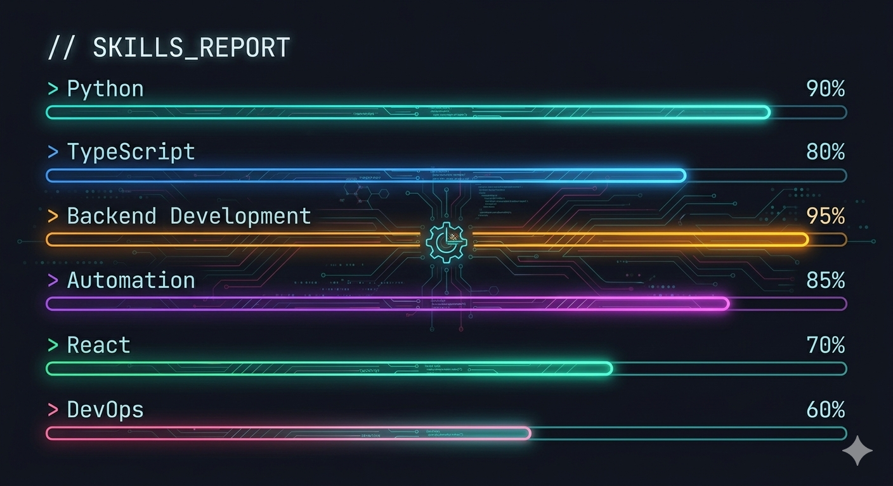
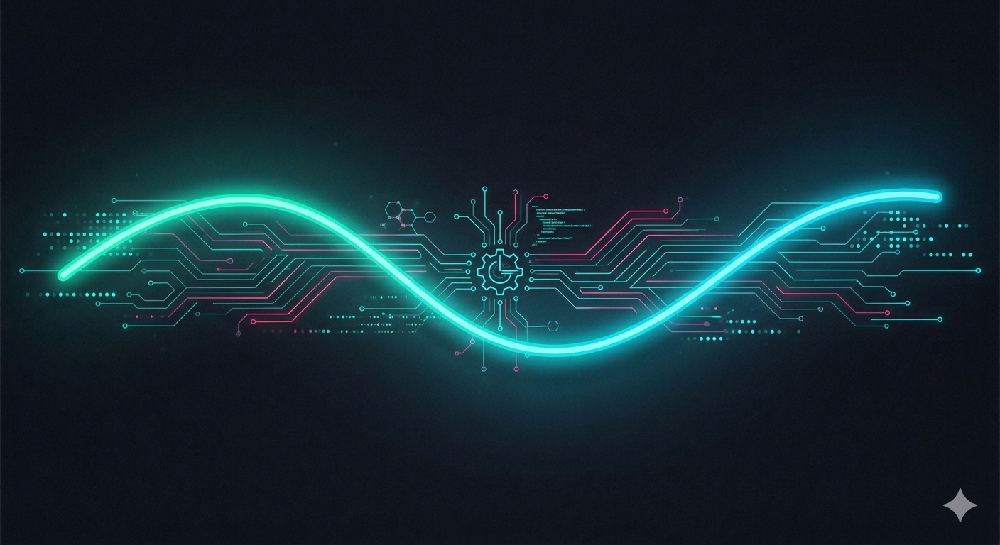
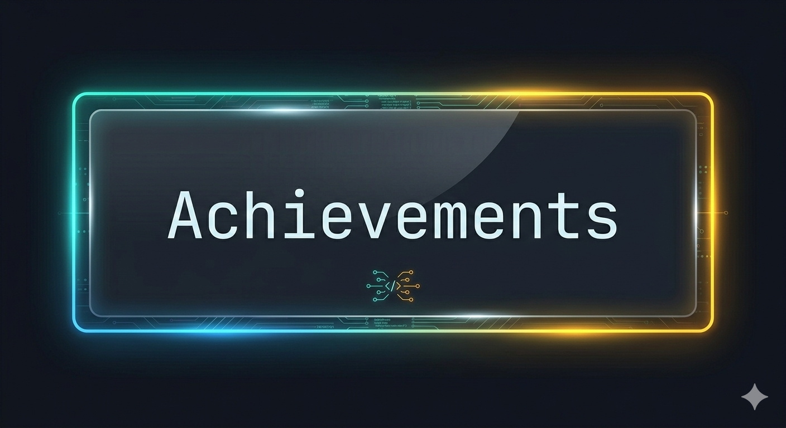
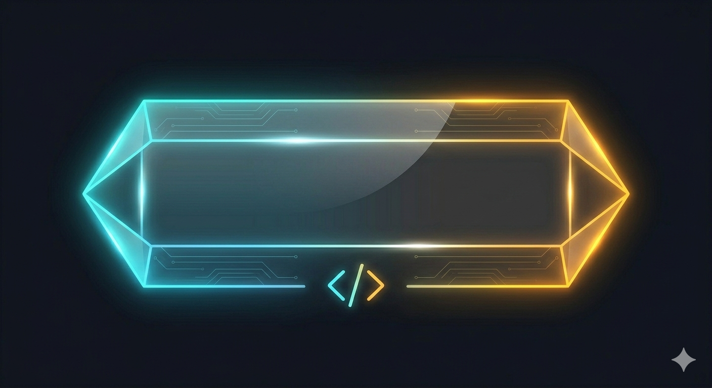

      
<!-- ======================== HERO / INTRO   ========================     -->

 <!-- Animated Typing Banner: Fira Code, neon blue -->  

 
<!-- ======================== PROFILE IMAGE (PERFECT CIRCLE, NEON GLOW) ======================== -->

  <!-- 
    Uses inline SVG for best glow effect and ensures perfect c ircle.
    Styles kept within 'style' attribute for  GitHub Markdown compatibility.
  -->
  
    <svg width="162" height="162" viewBox="0 0 162 162" style="position:absolute;top:0;left:0;z-index:0;" xmlns="http://www.w3.org/2000/svg">
      <defs>
        <radialGradient id="neonGradient" cx="50%" cy="50%" r="50%">
          <stop offset="0%" stop-color="#23FFE2" stop-opacity="0.66" />
          <stop offset="70%" stop-color="#23FFE2" stop-opacity="0.46" />
          <stop offset="90%" stop-color="#fb196b" stop-opacity="0.36" />
          <stop offset="100%" stop-color="#232b37" stop-opacity="0.15" />
          <stop offset="100%" stop-color="transparent" stop-opacity="0"/>
        </radialGradient>
      </defs>
      <circle cx="81" cy="81" r="78" fill="none" stroke="url(#neonGradient)" stroke-width="6"/>
    </svg>
    
  

<!-- ======================== HERO CARD / ABOUT ======================== -->

  
    
  <b>
    
      Building robust backends & automating workflows.
       
      Clean code, efficient ops, future-ready products.
    
  </b>
  <em>
     <b>Backend · Automation · Cloud · Open Source</b>
     
     
    <a href="https://tamirat-chi.vercel.app/">my-portifolio</a> &nbsp;|&nbsp; tamiratdereje@gmail.com
  </em>

<!-- ======================== TECH STACK ======================== -->
<h2 align="center">🛠️ Tech Stack & Tools</h2>

  
  
  
  
  
  
  
  
  
  
  
  

<!-- ======================== SKILLS SHOWCASE (PROGRESS BARS) ======================== -->
<h2 align="center">📊 Skills Overview</h2>

  

<!-- ======================== GITHUB DASHBOARD / ACTIVITY ========================= -->

  

  

  

<!-- ======================== MODERN FEATURED PROJECTS (PROFESSIONAL CARDS) ======================== -->
<h2 align="center">🚀 Featured Projects</h2>

  <!-- Card Container -->
  <table>
    <tr>
      <td width="340" valign="top">
       <!-- -->
        <b style="font-size:1.13em; color:#00FFD8;">E-Commerce  Platform</b> 
        Full-stack modern online shopping system with payment integration and admin dashboard.
      </td>
      <td width="340" valign="top">
       <!-- -->
        <b style="font-size:1.13em; color:#fb196b;">AI Automation System</b> 
        Backend automation tools for workflow optimization and process automation.
      </td>
    </tr>
    <tr>
      <td width="340" valign="top">
        <a href="https://github.com/tamed29/cloud-saas-dashboard" target="_blank">
         <!-- -->
        </a>
        <b style="font-size:1.13em; color:#f2a900;">Cloud SaaS Dashboard</b> 
        Secure cloud-based analytics dashboard with real-time monitoring.
      </td>
      <td width="340" valign="top">
        <a href="https://github.com/tamed29/api-platform" target="_blank">
         <!-- -->
        </a>
        <b style="font-size:1.13em; color:#23FFE2;">Developer API Platform</b> 
        REST API service with authentication, logging, and performance optimization.
      </td>
    </tr>
  </table>

<!-- ======================== PROFESSIONAL PROJECTS / COMPLETED WORK (EQUAL CARD HEIGHTS & BUTTONS) ======================== -->
<h2 align="center" style="color:#23FFE2;">
  💼 Professional Projects & Completed Work
</h2>

  <table width="95%" align="center" style="border-spacing:18px;">
    <tr>
      <td style="background:rgba(35,47,63,0.92); border-radius:17px; padding:20px 20px; box-shadow:0 2px 28px 0 #1b1d20a8; vertical-align:top; min-width:290px; min-height:230px;" valign="top" width="33%">
        <b style="color:#00FFD8; font-size:1.08em;">Wubet Amha Humanitarian Website</b> 
        Website for a humanitarian association in Arba Minch supporting community initiatives.
          
        
      </td>
      <td style="background:rgba(35,47,63,0.92); border-radius:17px; padding:20px 20px; box-shadow:0 2px 28px 0 #1b1d20a8; vertical-align:top; min-width:290px; min-height:230px;" valign="top" width="33%">
        <b style="color:#fb196b; font-size:1.08em;">AMU Digital PC Registration System</b> 
        Digital PC registration and asset management system for Arba Minch University.
          
     
      </td>
      <td style="background:rgba(35,47,63,0.92); border-radius:17px; padding:20px 20px; box-shadow:0 2px 28px 0 #1b1d20a8; vertical-align:top; min-width:290px; min-height:230px;" valign="top" width="33%">
        <b style="color:#f2a900; font-size:1.08em;">Aethelgard Boutique Hotel & Spa</b> 
        Modern luxury hotel experience with elegant accommodation, wellness spa services, and exceptional guest comfort. .
          
           
      </td>
    </tr>
  </table>

<!-- ======================== SECTION SEPARATOR ======================== -->

  

<!-- ======================== ACHIEVEMENTS SECTION (MODERN BADGES) ======================== -->
<h2 align="center">🏆 Achievements & Recognition</h2>

  

  
  
  
  
  
  
  
  
  

<!-- ======================== VISITOR COUNTER BADGE ======================== -->

  

<!-- ======================== CONTACT ME (SHIELDS BADGES) ======================== -->
<h2 align="center">🤝 Connect & Links</h2>

  
  
  
  

<!-- ======================== FOOTER / SIGNATURE MOTTO ======================== -->

  
   
  <i>"Code. Automate. Innovate. Every commit builds your future."</i>
   
  © 2026 Tamirat Dereje &mdash; <a href="https://github.com/tamed29">tamed29</a>

